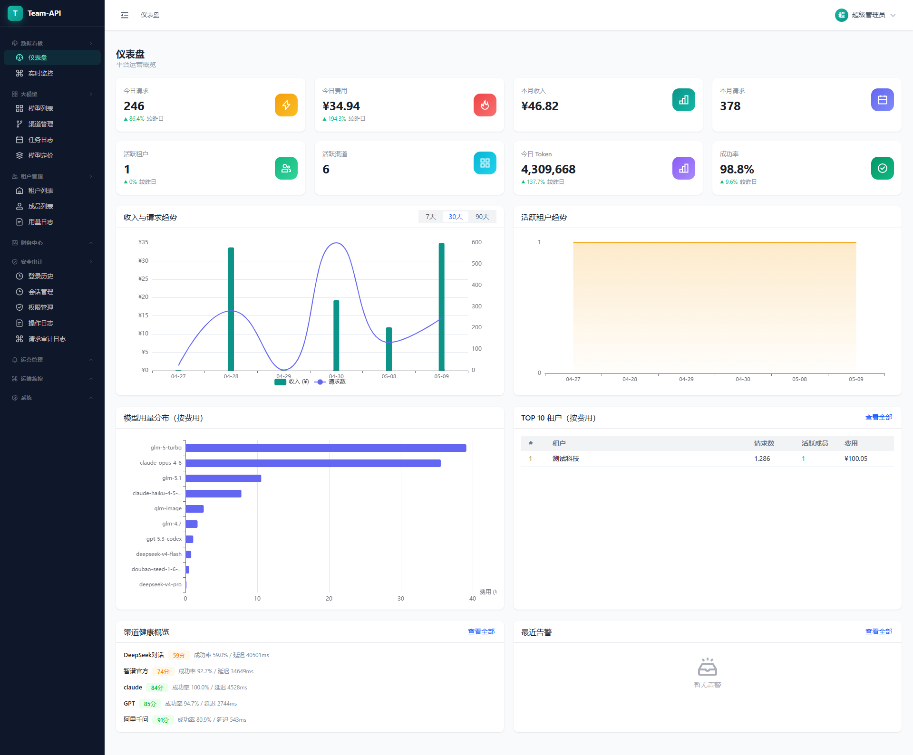
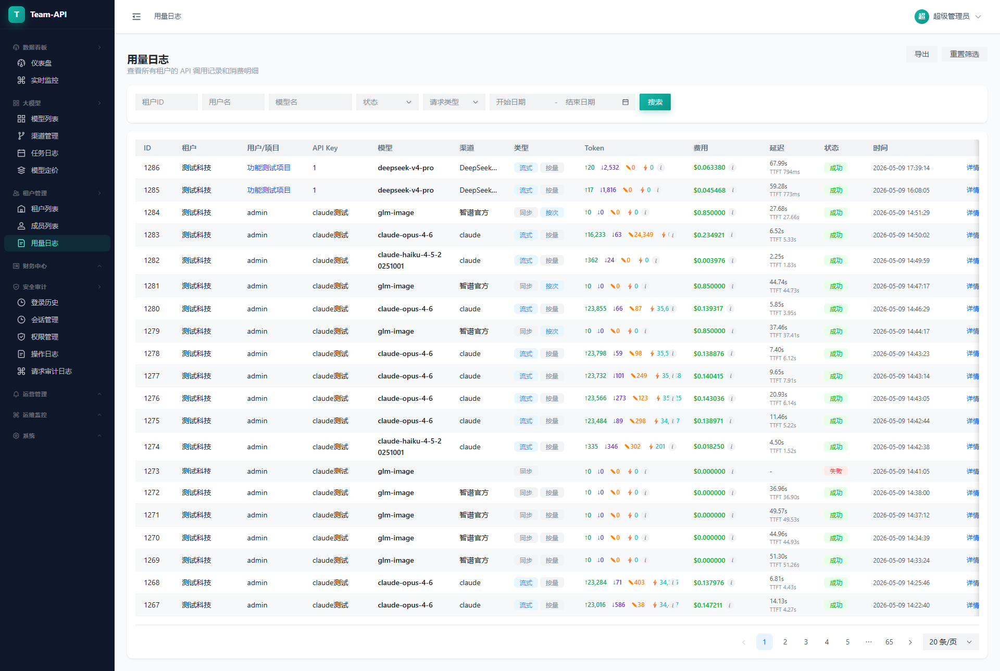
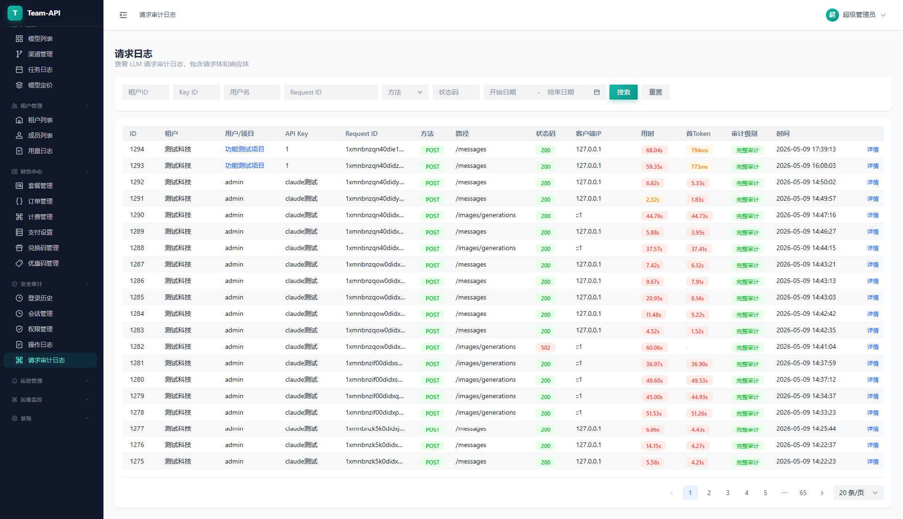
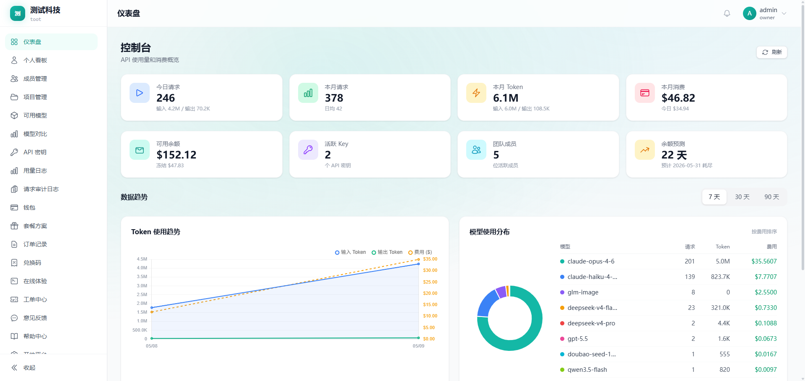
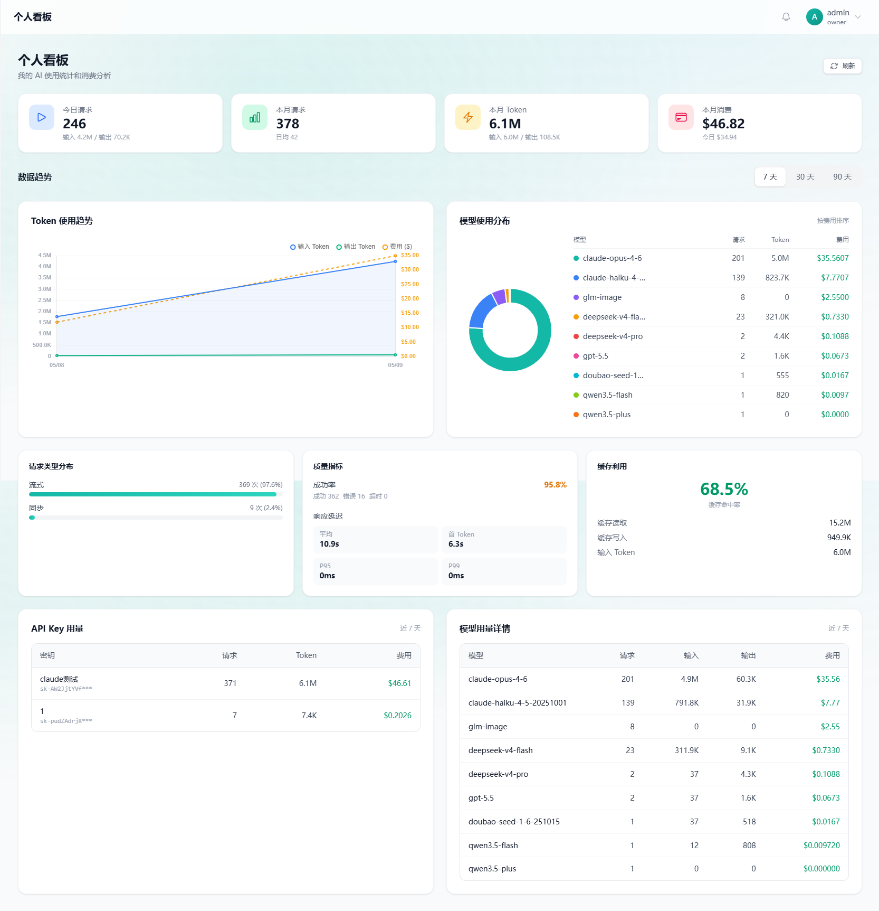
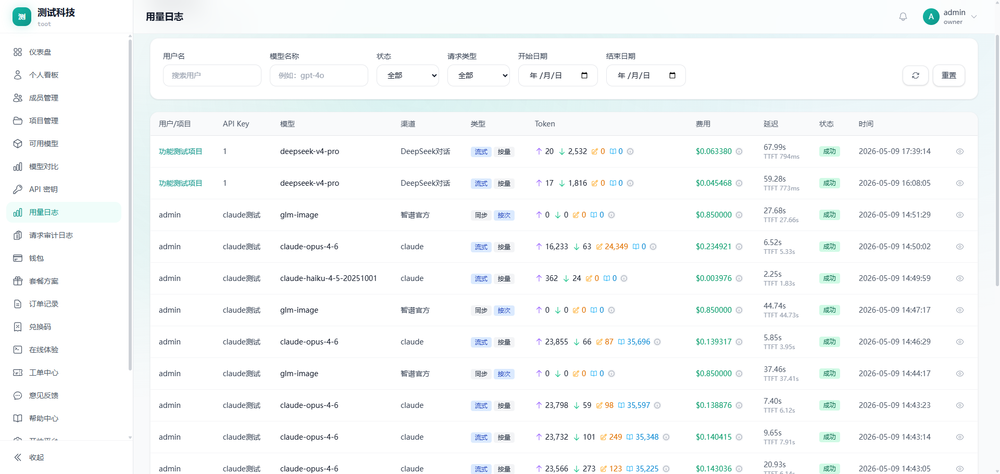
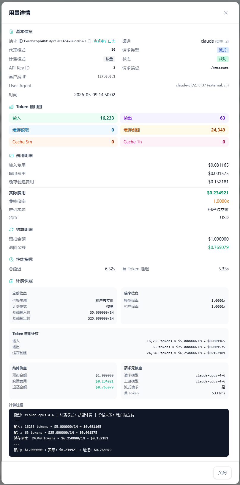
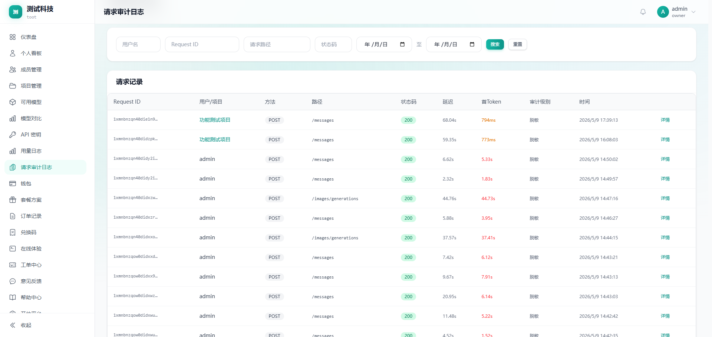
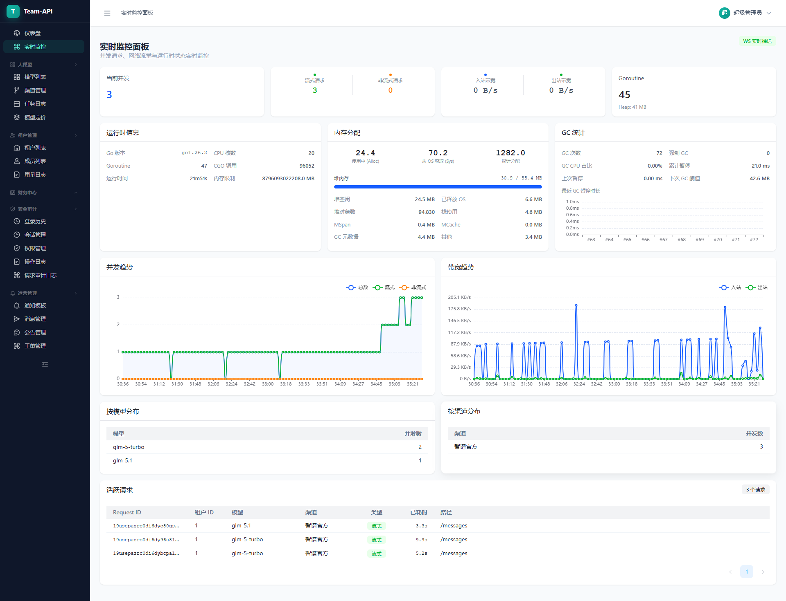

<div align="center">

# Team-API

**多租户 大模型 API 网关 SaaS 平台**

统一接入 OpenAI、Claude、Gemini 等 25+ 大模型供应商，提供计费、限流、监控和多租户管理能力。

[](https://go.dev/)
[](https://goframe.org/)
[](https://vuejs.org/)
[](https://www.postgresql.org/)
[](https://redis.io/)
[](LICENSE)

</div>

---

## 功能特性

- **多租户架构** — 行级租户隔离，管理后台与租户控制台双独立用户体系
- **25+ 大模型供应商** — OpenAI、Claude、Gemini、DeepSeek、通义千问、智谱、Ollama 等
- **OpenAI 兼容 API** — 无缝替换 OpenAI API，支持对话补全、向量嵌入、图像生成、语音、实时通信等
- **智能渠道调度** — 优先级/权重路由、自动故障转移、健康监控、渠道亲和性
- **五层额度模型** — 租户钱包 → 套餐额度 → 成员额度 → 项目预算 → Key 额度
- **实时计费引擎** — 预扣 → 转发 → 结算 → 退款，Redis 原子操作保证并发安全
- **双控制台** — 管理后台（Naive UI）用于平台运营 + 租户控制台（TailwindCSS）面向终端用户
- **全链路可观测** — 请求日志、操作审计、监控告警，Request ID 贯穿全链路


> 在线演示地址：
> 
> 管理端：https://team-api.net/admin/, 为做好数据安全措施，暂不公开登录方式
> 
> 用户端：https://team-api.net, 用户名：liu@163.com, 密码：Demo123456

---

## 项目截图

### 管理后台

<table>
  <tr>
    <td align="center">管理仪表盘</td>
    <td align="center">用量统计</td>
  </tr>
  <tr>
    <td></td>
    <td></td>
  </tr>
  <tr>
    <td align="center" colspan="2">请求日志</td>
  </tr>
  <tr>
    <td align="center" colspan="2"></td>
  </tr>
</table>

### 租户控制台

<table>
  <tr>
    <td align="center">租户仪表盘</td>
    <td align="center">成员管理</td>
  </tr>
  <tr>
    <td></td>
    <td></td>
  </tr>
  <tr>
    <td align="center" colspan="2">用量统计</td>
  </tr>
  <tr>
    <td align="center" colspan="2"></td>
  </tr>
  <tr>
    <td align="center" colspan="2">用量详情</td>
  </tr>
  <tr>
    <td align="center" colspan="2"></td>
  </tr>
  <tr>
    <td align="center" colspan="2">请求日志</td>
  </tr>
  <tr>
    <td align="center" colspan="2"></td>
  </tr>
</table>

### 运维监控

<table>
  <tr>
    <td align="center">实时监控面板</td>
  </tr>
  <tr>
    <td align="center"></td>
  </tr>
</table>

## 技术栈

| 层级 | 技术选型 |
|------|---------|
| 后端框架 | Go + [GoFrame v2](https://goframe.org/) |
| 数据库 | PostgreSQL 15 |
| 缓存 | Redis 7 + 内存缓存（双层） |
| 数据库迁移 | [Goose](https://github.com/pressly/goose) |
| 管理后台前端 | Vue 3 + Vite + [Naive UI](https://www.naiveui.com/) + TailwindCSS |
| 租户控制台前端 | Vue 3 + Vite + TailwindCSS |
| 对象存储 | S3 / 阿里云 OSS / 腾讯云 COS |
| 前端包管理 | bun |

## 快速开始

### 环境要求

- Go 1.25+
- PostgreSQL 15+
- Redis 7+
- Node.js 18+ & bun（前端开发）
- [GoFrame CLI](https://goframe.org/pages/viewpage.action?pageId=1114260)（`gf` 命令）
- [Goose](https://github.com/pressly/goose)（数据库迁移）

### 1. 克隆仓库

```bash
git clone https://github.com/qianfree/team-api.git
cd team-api
```

### 2. 启动基础设施

使用 Docker Compose 启动 PostgreSQL 和 Redis：

```bash
docker compose -f manifest/docker/docker-compose.yaml up -d
```

### 3. 修改配置

复制并编辑配置文件：

```bash
cp manifest/config/config.yaml.example manifest/config/config.yaml
```

核心配置项：

```yaml
server:
  address: ":18888"

database:
  default:
    type: "pgsql"
    link: "pgsql:user:password@tcp(127.0.0.1:5432)/team-api?sslmode=disable"

redis:
  default:
    address: "127.0.0.1:6379"
    db: 0

jwt:
  secret: "your-secret-key-change-in-production"

crypto:
  encryptionKey: "a1b2c3d4e5f6a7b8c9d0e1f2a3b4c5d6e7f8a9b0c1d2e3f4a5b6c7d8e9f0a1b2"
```

### 4. 执行数据库迁移

```bash
make migrate-up
```

### 5. 启动后端服务

```bash
# 开发模式（热编译）
make run

# 或直接运行
gf run main.go
```

API 服务将在 `http://localhost:18888` 启动。

### 6. 启动前端（可选）

```bash
# 管理后台
cd web/admin
bun install
bun dev

# 租户控制台（另开终端）
cd web/tenant
bun install
bun dev
```

### 7. 生产构建

```bash
# 仅构建后端（前端由 Nginx/CDN 独立托管）
make build

# 前后端一体（前端嵌入二进制，单文件部署）
make build-all
```

#### 交叉编译

通过 `GOOS` 和 `GOARCH` 参数指定目标平台，在任意系统上构建其他平台的二进制：

```bash
# Linux x86_64
make build GOOS=linux GOARCH=amd64

# Linux ARM64（树莓派、ARM 服务器）
make build GOOS=linux GOARCH=arm64

# macOS Apple Silicon
make build GOOS=darwin GOARCH=arm64

# macOS Intel
make build GOOS=darwin GOARCH=amd64

# Windows
make build GOOS=windows GOARCH=amd64

# 交叉编译 + 嵌入前端
make build-all GOOS=linux GOARCH=amd64
```

输出文件名自动适配：Windows 下为 `team-api.exe`，其他平台为 `team-api`。

## API 接口

### AI 代理接口（OpenAI 兼容）

| 接口 | 说明 |
|------|------|
| `POST /v1/chat/completions` | 对话补全 |
| `POST /v1/embeddings` | 文本向量嵌入 |
| `POST /v1/images/generations` | 图像生成 |
| `POST /v1/audio/transcriptions` | 语音转文字 |
| `POST /v1/audio/translations` | 语音翻译 |
| `POST /v1/audio/speech` | 文字转语音 |
| `GET  /v1/models` | 获取可用模型列表 |
| `POST /v1/moderations` | 内容审核 |
| `POST /v1/rerank` | 重排序 |
| `WS   /v1/realtime` | 实时通信（WebSocket） |

**使用示例：**

```bash
curl http://localhost:18888/v1/chat/completions \
  -H "Authorization: Bearer your-api-key" \
  -H "Content-Type: application/json" \
  -d '{
    "model": "gpt-4o",
    "messages": [{"role": "user", "content": "你好！"}]
  }'
```


## Docker 部署

### 快速部署（推荐）

只需两个文件，无需克隆整个仓库：

```bash
# 1. 创建部署目录
mkdir team-api && cd team-api

# 2. 下载 docker-compose.yaml 和示例配置
curl -O https://raw.githubusercontent.com/qianfree/team-api/main/manifest/docker/docker-compose.yaml
curl -o config.yaml https://raw.githubusercontent.com/qianfree/team-api/main/manifest/docker/config.example.yaml

# 3. 编辑配置文件（修改数据库密码、Redis 密码、JWT 密钥、加密密钥等）
cp config.example.yaml config.yaml
vim config.yaml

# 4. 修改 docker-compose.yaml 中的密码（与 config.yaml 保持一致）
#    - POSTGRES_PASSWORD
#    - Redis --requirepass
vim docker-compose.yaml

# 5. 一键启动所有服务
docker compose up -d

# 6. 更新版本，建议只更新主程序，避免数据库版本更新后有新特性不兼容
docker compose pull app
docker compose up -d 
```

服务启动后访问 `http://localhost:18888`，首次部署会进入系统初始化向导（`/api/setup`）。

### 从源码构建

```bash
# 克隆仓库
git clone https://github.com/qianfree/team-api.git
cd team-api

# 构建并启动（多阶段构建：前端编译 → Go 编译 → 精简运行镜像）
docker compose --profile build up -d --build
```

也可以单独构建镜像推送到自己的 Registry：

```bash
# 构建镜像
docker build -t team-api:latest -f manifest/docker/Dockerfile .

# 指定版本号
docker build -t team-api:v1.0.0 --build-arg VERSION=v1.0.0 -f manifest/docker/Dockerfile .
```


### 配置说明

部署配置文件位于 `manifest/docker/`：

| 文件 | 用途 |
|------|------|
| `config.yaml` | 应用运行时配置（数据库连接、Redis、JWT 等） |
| `Dockerfile` | 多阶段构建（bun 前端 → Go 编译 → Alpine 运行） |
| `docker-compose.yaml` | 服务编排（PostgreSQL + Redis + App） |

### 审计日志独立数据库（可选）

大模型请求审计日志（`aud_request_logs`）体量大、写入频繁，可将其存到独立的 PostgreSQL 实例，与主业务库物理隔离，避免影响主库响应速度。其余审核表（操作日志、登录历史、敏感数据访问、内容过滤）数据量小，留在主库即可。

**1. 在独立库中建表：**

```bash
# 连接审计数据库执行建表脚本
psql -h host -p port -U user -d team-api-audit -f docs/audit-db-schema.sql
```

**2. 配置 `manifest/config/config.yaml`：**

取消 `database.audit` 分组的注释并填写连接信息：

```yaml
database:
  audit:
    type:     "pgsql"
    link:     "pgsql:user:password@tcp(127.0.0.1:5432)/team-api-audit?sslmode=disable"
    timezone: "Asia/Shanghai"
    maxIdle:  10
    maxOpen:  50
```

**3. 重启服务：**

```bash
make run
```

**工作原理：**

- 仅 `aud_request_logs`（大模型请求审计）走独立库，其余审计表仍在主库
- 配置了 `database.audit.link` 时，`aud_request_logs` 自动写入独立库；未配置时一切照常写入主库

## 开发指南

### 代码生成

GoFrame CLI 从定义文件自动生成样板代码：

```bash
# 从数据库表结构生成 DAO/DO/Entity
gf gen dao

# 从 Logic 层生成 Service 接口
gf gen service

# 从 API 定义生成 Controller
gf gen ctrl
```

**重要：** 新增 API 时必须按以下顺序执行：

1. 在 `api/` 中定义请求/响应结构体
2. 在 `internal/logic/` 中实现业务逻辑
3. 执行 `gf gen service`
4. 执行 `gf gen ctrl`

### Makefile 命令

```bash
make run             # 启动开发服务器（热编译）
make build           # 构建后端二进制（不含前端）
make build-web       # 仅构建前端资源
make build-all       # 前后端一体构建（前端嵌入二进制）
make tidy            # 整理 Go 模块依赖
make ctrl            # 从 API 定义生成 Controller
make dao             # 从数据库生成 DAO/DO/Entity
make service         # 从 Logic 层生成 Service 接口
make migrate-up      # 执行数据库迁移
make migrate-down    # 回滚上一次迁移
make migrate-status  # 查看迁移状态
```

## 主线路线图

1. 完善大模型支持，特别是图像和视频的支持
2. 支付模块（Easy Pay）
3. 插件功能（定制功能通过插件实现，确保不与主线代码冲突）
4. 开放平台（对接OA的能力，方便企业对接管理）
5. 在线升级


## 参与贡献

1. Fork 本仓库
2. 创建特性分支（`git checkout -b feature/amazing-feature`）
3. 提交更改（`git commit -m 'feat: 添加某功能'`）
4. 推送分支（`git push origin feature/amazing-feature`）
5. 发起 Pull Request

请遵循项目现有代码风格和 [Conventional Commits](https://www.conventionalcommits.org/zh-hans/) 提交规范。

## 在线交流
欢迎加QQ群聊天吹水：1095286563

**提需求，反馈bug，摸鱼聊天都可以哦~**


## 许可证

Copyright (C) 2026 qianfree. 本项目采用 [GNU Affero General Public License v3.0](LICENSE) 许可证。

### 核心要求

- **开源义务**：修改并分发本项目的代码，必须以相同协议开源
- **网络条款**：通过网络向用户提供基于本项目的服务（如 SaaS），也必须向用户开放修改后的源代码
- **自由使用**：个人学习、研究、内部使用、商业运营均可，前提是遵守上述开源义务

### 商业授权

如果你想将本项目代码用于闭源商业产品，AGPL-3.0 许可证不适用。需要单独获取商业授权，请联系：**406615373@qq.com**

## 致谢

- [GoFrame](https://goframe.org/) — Go 应用开发框架
- [new-api](https://github.com/Calcium-Ion/new-api) — AI 网关参考实现
- [sub2api](https://github.com/sub2api/sub2api) — 监控与亲和性参考实现
- [Naive UI](https://www.naiveui.com/) — Vue 3 组件库
